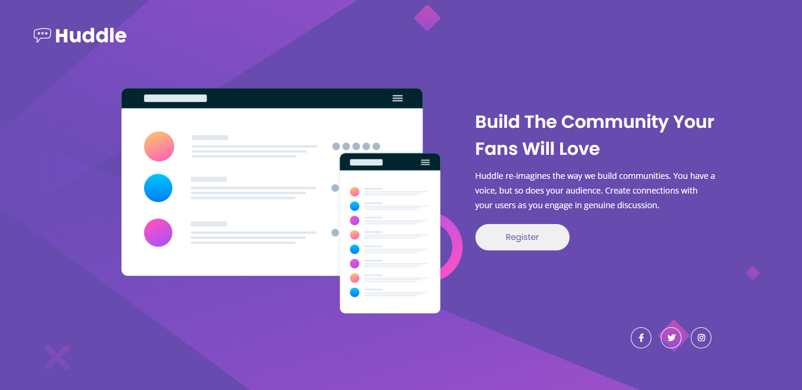
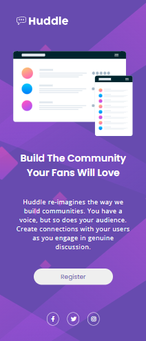

# Desafio Frontend Mentor - Landing Page Huddle

Esta é a resolução da quest dos estudos de CSS e HTML avançados. Uma landing page com responsividade para desktop, tablet e mobile.

---

## 🦄 Design pretendido 

---

## 🦓 Design alcançado

---

## ⚙️ Testes

Os testes de responsividade foram realizados com o Chrome Dev Tools e Responsive Viewer.

---

## 🛠️ Construído com

* HTML5
* CSS3
* Visual Studio Code

---

## 🕜 Tempo necessário

Foi necessário dois dias para análise e entendimento do desafio, criação da página e, posteriormente, para tornar o site satisfatoriamente responsivo e fazer ajustes de erros.

---

## 🌩 Desafios

Como de costume, um excelente plano foi feito tornando o projeto, aparentemente, simples. Durante a execução a página foi ficando completamente travada e foi difícil acertar os erros para fluidez dos elementos. Depois de acertados os tamanhos na estilização principal foi muito mais fácil criar a responsividade para telas menores. O resultado não ficou ótimo mas ficou satisfatório. 

---

## 🖌 Autora

Feito com carinho e desespero por [Mayara Gomes](https://gist.github.com/gomessmay) 🖤